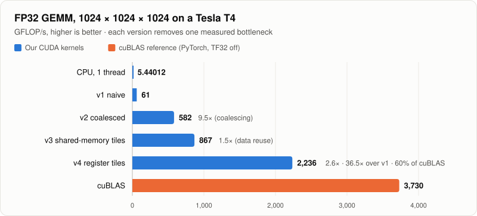
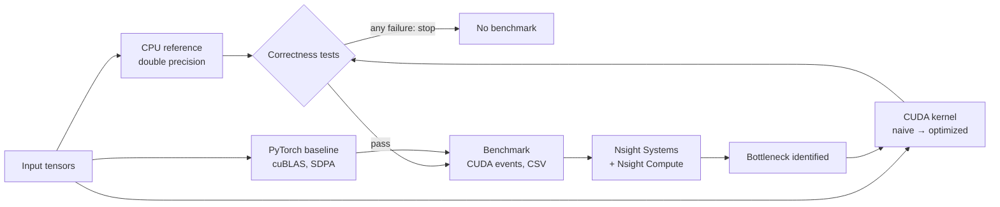
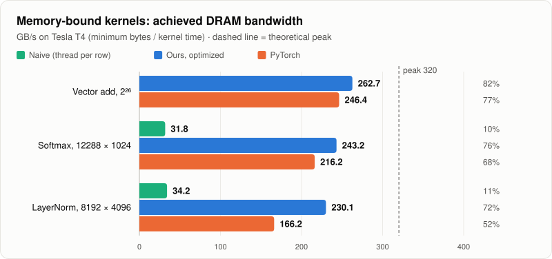
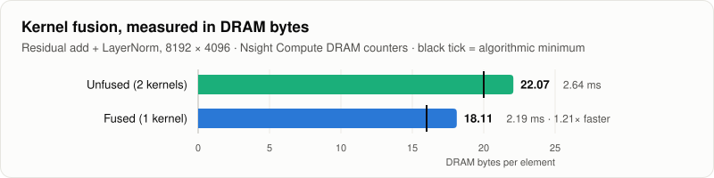
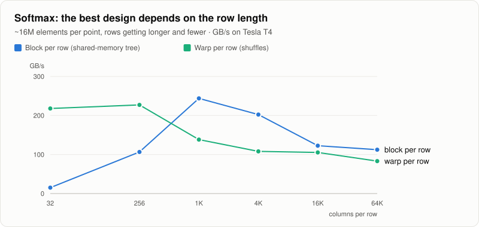
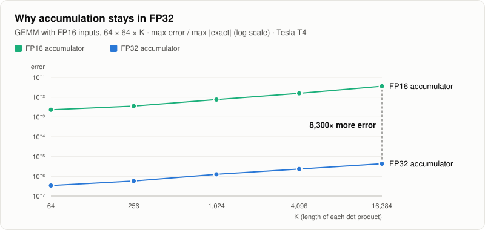
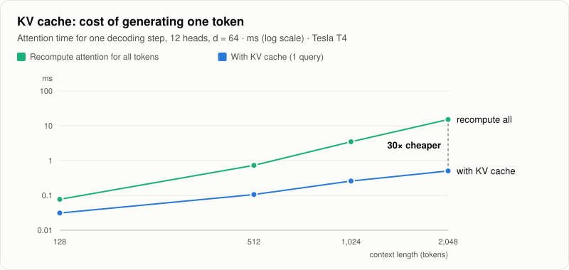

<div align="center">

# CUDA Transformer Inference Performance

**The GPU kernels behind Transformer inference, written from scratch in CUDA,
optimized step by step, and explained with profiler evidence.**

GEMM · Softmax · LayerNorm · Attention · KV cache · FP16 Tensor Cores

[](https://developer.nvidia.com/cuda-toolkit)
[](https://isocpp.org/)
[](benchmarks/)
[](benchmarks/NVIDIA_A100_SXM4_40GB/tests.txt)
[](docs/10_nsight_profiling.md)
[](python/)

[Results](docs/12_results.md) · [Optimization story](docs/11_optimization.md) · [Profiling](docs/10_nsight_profiling.md) · [Docs](docs/01_project_overview.md) · [Run it](#run-it)

</div>

---

## Highlights

All numbers measured on an NVIDIA Tesla T4 (CUDA 13.0), FP32 unless noted. Every kernel is
verified against a double-precision CPU reference before it is timed.

<table>
<tr>
<td align="center" width="25%"><h3>36.5×</h3>GEMM speedup, naive → register-tiled<br><sub>61 → 2,236 GFLOP/s · 60% of cuBLAS</sub></td>
<td align="center" width="25%"><h3>1.21×</h3>fused residual-add + LayerNorm<br><sub>22.1 → 18.1 DRAM bytes/element (Nsight)</sub></td>
<td align="center" width="25%"><h3>30×</h3>cheaper decode step with KV cache<br><sub>vs recomputing attention, 2K context</sub></td>
<td align="center" width="25%"><h3>1.38×</h3>faster than PyTorch LayerNorm<br><sub>at LLaMA-7B hidden size (8192 × 4096)</sub></td>
</tr>
</table>

<p align="center">
  
</p>

<details>
<summary>Chart data as a table</summary>

| Version | What changed | GFLOP/s | Step gain |
|---|---|---:|---:|
| CPU, 1 thread | reference loop | 5.4 | – |
| v1 naive | one thread per output | 61.2 | – |
| v2 coalesced | `threadIdx.x` → columns (sectors/request 16.5 → 2.5) | 582.1 | 9.5× |
| v3 shared-memory tiles | 32×32 tiles, data reuse | 867.4 | 1.5× |
| v4 register tiles | 4×4 outer product per thread | 2,235.6 | 2.6× |
| cuBLAS (reference) | NVIDIA's library, TF32 off | 3,729.9 | – |

</details>

---

## What's inside

| Operation | Versions (each tested, benchmarked and profiled) | Key idea |
|---|---|---|
| **GEMM** | naive → coalesced → shared-memory tiled → register-tiled → **WMMA Tensor Cores** (FP16, FP32 accumulate) | memory coalescing, data reuse, outer products, warp-level MMA |
| **Softmax** | thread/row → block/row (shared tree) → warp/row (`__shfl_sync`) → online softmax | numerical stability, parallel reductions |
| **LayerNorm** | thread/row → warp/row → block/row with the row in registers → **fused residual add** | two-pass variance, read-once kernels, kernel fusion |
| **Attention** | unfused (batched GEMM + softmax) → **fused online-softmax kernel**, causal mask, **KV-cache decode** | seq² memory, FlashAttention-style fusion, decode vs prefill |
| **Vector add** | one thread/element → grid-stride loop | indexing, bandwidth ceiling (82% of peak) |
| **Precision** | FP32 vs FP16 vs FP16-in / FP32-accumulate | measured: FP16 accumulation ~8,000× more error at K = 16K, and overflow |
| **Quantization** | decode GEMV with FP32 → FP16 → **INT8 weights** (per-row or per-tensor scale) | weight-only quantization: 4× fewer bytes for memory-bound decode, outliers vs scale granularity |

## How it works



Every optimization follows the same loop: **measure → form a hypothesis → check it with
hardware counters → change one thing → re-measure.** The profiler overturned the hypothesis
three times. Those cases are documented too: [docs/11 §7](docs/11_optimization.md).

## Results

### Memory-bound kernels reach 72–82% of peak bandwidth

Softmax, LayerNorm and residual adds do little math per byte, so their ceiling is DRAM
bandwidth. Reading the input once (LayerNorm keeps each row in registers) and picking the right
work split (one block per long row) gets within reach of the hardware limit.

<p align="center"></p>

<details>
<summary>Data</summary>

| Kernel | Naive | Ours, optimized | PyTorch | Peak |
|---|---:|---:|---:|---:|
| Vector add, 2²⁶ elements | – | 262.7 GB/s (82%) | 246.4 GB/s | 320.1 GB/s |
| Softmax, 12288 × 1024 | 31.8 GB/s | 243.2 GB/s (76%) | 216.2 GB/s | 320.1 GB/s |
| LayerNorm, 8192 × 4096 | 34.2 GB/s | 230.1 GB/s (72%) | 166.2 GB/s | 320.1 GB/s |

</details>

### Kernel fusion, verified in hardware counters

Fusing the residual add into LayerNorm keeps the intermediate result in registers instead of
writing it to DRAM and reading it back. Nsight Compute's DRAM counters show the saving directly,
and it matches the measured speedup.

<p align="center"></p>

<details>
<summary>Data</summary>

| Pipeline | DRAM bytes / element | Algorithmic minimum | Time |
|---|---:|---:|---:|
| Unfused: vector add, then LayerNorm (2 kernels) | 22.07 | 20 | 2.64 ms |
| Fused add + LayerNorm (1 kernel) | 18.11 | 16 | 2.19 ms (1.21× faster) |

</details>

### There is no single best softmax kernel

With one warp per row, short rows are fast. For long rows, too many rows are in flight to stay
in the 4 MB L2 cache, and the kernel re-reads its input from DRAM (2.77× the input size,
measured with Nsight). One block per row wins from 1,024 columns upward.

<p align="center"></p>

<details>
<summary>Data (GB/s, ~16M elements per point)</summary>

| Columns per row | 32 | 256 | 1K | 4K | 16K | 64K |
|---|---:|---:|---:|---:|---:|---:|
| Block per row | 15.2 | 106.5 | **243.8** | **202.4** | **122.5** | **112.4** |
| Warp per row | **218.0** | **227.1** | 138.2 | 108.1 | 105.3 | 83.1 |

</details>

### FP16 storage, FP32 accumulation

FP16 halves the bytes and unlocks Tensor Cores (our WMMA GEMM: 1.49× over the best FP32 kernel).
But the running sum must stay in FP32: with an FP16 accumulator the error grows with K, and large
sums overflow to infinity.

<p align="center"></p>

<details>
<summary>Data (max error / max |exact|, FP16-rounded inputs)</summary>

| K | 64 | 256 | 1,024 | 4,096 | 16,384 |
|---|---:|---:|---:|---:|---:|
| FP32 accumulator | 3.44e-7 | 5.82e-7 | 1.27e-6 | 2.36e-6 | 4.35e-6 |
| FP16 accumulator | 2.34e-3 | 3.59e-3 | 7.63e-3 | 1.58e-2 | 3.62e-2 |

Overflow test (inputs in [0, 8], K = 8,192): FP16 accumulator produced inf in 256 of 256 outputs;
FP32 accumulation, none.

</details>

### KV cache: why LLM decoding stores past keys and values

Generating one token with a KV cache means one query against the cached keys. Without the cache,
attention is recomputed for every token, and the gap grows with context length.

<p align="center"></p>

<details>
<summary>Data (ms, fused attention kernel, 12 heads, d = 64)</summary>

| Context (tokens) | 128 | 512 | 1,024 | 2,048 |
|---|---:|---:|---:|---:|
| With KV cache (1 query) | 0.031 | 0.106 | 0.259 | 0.503 |
| Recompute all tokens | 0.077 | 0.729 | 3.477 | 15.093 |
| Ratio | 2.5× | 6.9× | 13.4× | **30.0×** |

</details>

All charts are generated from the measured CSV files by
[`assets/make_charts.js`](assets/make_charts.js) (`node assets/make_charts.js`), so they always
match the data.

**Also measured on an A100 (SXM4, 40 GB).** The charts above are from the T4. The same code on
the A100 reaches 81–88% of DRAM peak on the memory-bound kernels, and GEMM v4 reaches 37% of
FP32 peak (T4: 27%). cuBLAS gains more (46% → 85%), so the gap to cuBLAS grows. A100 tables
and the T4 comparison are in [docs/12 §9](docs/12_results.md#9-nvidia-a100-sxm4-40gb), with
A100 charts in [assets/NVIDIA_A100_SXM4_40GB/](assets/NVIDIA_A100_SXM4_40GB/).

**INT8 weight-only quantization (A100, decode, 7B-class layers):** FP16 weights are 1.9× faster
than FP32, as predicted from the bytes. With the first INT8 kernel, INT8 weights were only
2.1–2.7× faster, not the predicted 4×. Nsight Compute showed why: weight bytes did drop 4×, but
each weight still needs its activation read through L1, and L1 hit 94% of its ceiling. A second
kernel reads each activation once for 2 rows: **3.2× faster than FP32** (MLP up; 2.7× on MLP
down), with L1 traffic falling exactly as the model predicted. 4 or 8 rows per warp are slower:
too few warps remain to keep DRAM busy. Per-row scales keep the error at 1.5% when a few outlier
weights are present; a single per-tensor scale gives 20%
([docs/12 §9.1–9.2](docs/12_results.md#91-int8-weight-only-quantization-decode-gemv-docs08-9)).

## Profiler-verified results

| Claim | Evidence (Nsight Compute, T4) |
|---|---|
| Coalescing fixed GEMM v1 | global-load sectors/request **16.5 → 2.5 → 4.0** (ideal 4); DRAM reads **433 → 33 MB** |
| Register tiling broke the shared-memory bottleneck | stall reason MIO Throttle → none dominant; cycles/instruction **37.9 → 12.95** |
| Fusion speedup = fewer bytes | **22.07 → 18.11 B/element**, ratio 1.22 vs measured 1.21× |
| No spills, no bank conflicts in the tiled kernels | `LOCAL:0` for all kernels; 0 shared-memory conflicts in GEMM v3/v4 and padded attention GEMM |
| v4 at 60% of cuBLAS | tail effect (2.13 waves), 72 registers → 75% occupancy, 0.86 eligible warps/scheduler |
| WMMA kernel is starved, not slow | issue slots 5.5% busy; 110 of 124 cycles/instruction waiting on global loads |

Full tables and all 13 hypotheses: [docs/10 §9](docs/10_nsight_profiling.md) ·
raw reports: [Tesla_T4](profiling/reports/Tesla_T4/), [A100](profiling/reports/NVIDIA_A100_SXM4_40GB/)

<details>
<summary><b>More measured results</b></summary>

| Operation | Size | Ours (best) | PyTorch | Notes |
|---|---|---|---|---|
| Softmax | 12288 × 1024 | **243.2 GB/s** (76% of peak) | 216.2 GB/s | block per row; warp per row wins for ≤ 256 columns |
| LayerNorm | 8192 × 4096 | **230.1 GB/s** (72%) | 166.2 GB/s | row cached in registers, input read once |
| Add + LayerNorm | 8192 × 4096 | **2.19 ms** (fused) | 3.28 ms (2 kernels) | 1.21× over our unfused, 1.5× over eager PyTorch |
| GEMM, FP16 Tensor Cores | 1024³ | 3,290 GFLOP/s (1.49× our FP32) | 35,884 GFLOP/s | ours lacks shared-memory staging; see profiling |
| Attention, causal | 12 × 2048 × 64 | 15.0 ms fused, no score buffer | – | unfused needs a 192 MB score matrix |

Everything, including negative results and caveats: [docs/12_results.md](docs/12_results.md)

</details>

---

## Run it

**Google Colab (no setup):** open [`notebooks/colab_run.ipynb`](notebooks/colab_run.ipynb),
choose `Runtime → Change runtime type → GPU`, run the cells. Profiling:
[`notebooks/colab_profile.ipynb`](notebooks/colab_profile.ipynb).

**Any Linux machine with an NVIDIA GPU:**

```bash
bash scripts/run_all.sh        # build → tests (stops on failure) → benchmarks → summary
# results: benchmarks/<GPU>/summary.md
```

Step by step:

```bash
cmake -S . -B build -DCMAKE_BUILD_TYPE=Release && cmake --build build -j
ctest --test-dir build --output-on-failure        # correctness first
./build/bench_matmul --csv matmul.csv             # any bench_*; --csv is optional
python3 python/benchmark.py --ops matmul softmax  # PyTorch baseline
bash profiling/ncu_kernels.sh gemm                # Nsight Compute on one case
```

**Other GPUs (A100, H100, …):** no code changes needed. The GPU is detected at run time, and
results go to `benchmarks/<GPU>/` and `profiling/reports/<GPU>/`, so runs never overwrite each
other. Before interpreting results, read the caveats (MIG slices, larger L2 caches, features our
kernels don't use): [docs/09 §21](docs/09_benchmarking.md).

**Requirements:** an NVIDIA GPU (detected at runtime; Tensor Core tests need compute
capability ≥ 7.0), CUDA Toolkit 11+, CMake ≥ 3.18, a C++17 compiler; PyTorch for the baseline
(`pip install -r requirements.txt`; preinstalled on Colab). If CMake rejects `native`
architectures, pass e.g. `-DCMAKE_CUDA_ARCHITECTURES=75` (T4).

## Project layout

```
kernels/        CUDA kernels + their launch functions (one file per operation)
src/cpu/        CPU reference implementations (ground truth)
src/utils/      error checking, RAII GPU memory, CUDA-event timers, device query
src/benchmark/  benchmark programs, CSV logger, profiling driver
tests/          correctness tests (ctest)
python/         PyTorch baseline and results summarizer
scripts/        run_all.sh: build → test → benchmark → summary
profiling/      Nsight scripts and reports
notebooks/      Colab notebooks
benchmarks/     measured results, one folder per GPU
assets/         README charts, generated from the results by make_charts.js
docs/           the learning guide (below)
```

## Documentation

A step-by-step guide that explains every kernel line by line, written to be read in order:

| # | Topic | # | Topic |
|---|---|---|---|
| [01](docs/01_project_overview.md) | Project overview and architecture | [08](docs/08_precision.md) | FP32 / FP16, Tensor Cores, quantization |
| [02](docs/02_cuda_fundamentals.md) | CUDA fundamentals, vector add | [09](docs/09_benchmarking.md) | Benchmarking methodology |
| [03](docs/03_memory_hierarchy.md) | Memory hierarchy and the roofline | [10](docs/10_nsight_profiling.md) | Nsight profiling and measured hypotheses |
| [04](docs/04_matrix_multiplication.md) | GEMM v1–v4, with 4×4 traces | [11](docs/11_optimization.md) | The optimization story |
| [05](docs/05_softmax.md) | Softmax and warp shuffles | [12](docs/12_results.md) | All measured results |
| [06](docs/06_layernorm.md) | LayerNorm and kernel fusion | [13](docs/13_interview_questions.md) | Interview questions and answers |
| [07](docs/07_attention.md) | Attention and the KV cache | | |

## Honest limits

- Measured on **two Colab GPUs**: the main results on a Tesla T4 (one run; its clock visibly
  throttles on long kernels, so repeat runs before quoting small differences), and an A100-SXM4-40GB
  ([docs/12 §9](docs/12_results.md#9-nvidia-a100-sxm4-40gb)). The charts above are T4 data.
- PyTorch comparisons are **FP32, eager mode, these shapes**. cuBLAS remains faster than our GEMMs.
- The fused attention kernel is FlashAttention-*style* (online softmax, no score matrix),
  not FlashAttention: it has no query/key tiling or Tensor Cores.
- Quantization is **INT8 weight-only, for the decode GEMV only** (per-row or per-tensor scales).
  No INT4, no group-wise scales, no INT8 Tensor Cores or activation quantization, and the weights
  are random, not a real model. Measured on the A100 only ([docs/12 §9.1](docs/12_results.md)).
