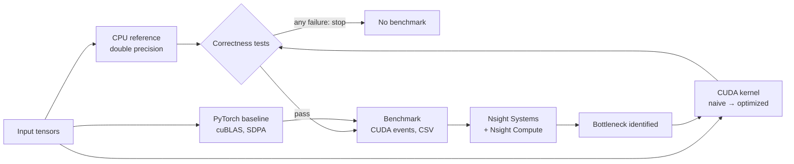

<div align="center">

# CUDA Transformer Inference Performance

**The GPU kernels behind Transformer inference, written from scratch in CUDA,
optimized step by step, and explained with profiler evidence.**

GEMM · Softmax · LayerNorm · Attention · KV cache · FP16 Tensor Cores

[](https://developer.nvidia.com/cuda-toolkit)
[](https://isocpp.org/)
[](benchmarks/Tesla_T4/)
[](benchmarks/Tesla_T4/tests.txt)
[](docs/10_nsight_profiling.md)
[](python/)

[Results](docs/12_results.md) · [Optimization story](docs/11_optimization.md) · [Profiling](docs/10_nsight_profiling.md) · [Docs](docs/01_project_overview.md) · [Run it](#run-it)

</div>

---

## Highlights

All numbers measured on an NVIDIA Tesla T4 (CUDA 13.0), FP32 unless noted. Every kernel is
verified against a double-precision CPU reference before it is timed.

<table>
<tr>
<td align="center" width="25%"><h3>36.5×</h3>GEMM speedup, naive → register-tiled<br><sub>61 → 2,236 GFLOP/s · 60% of cuBLAS</sub></td>
<td align="center" width="25%"><h3>1.21×</h3>fused residual-add + LayerNorm<br><sub>22.1 → 18.1 DRAM bytes/element (Nsight)</sub></td>
<td align="center" width="25%"><h3>30×</h3>cheaper decode step with KV cache<br><sub>vs recomputing attention, 2K context</sub></td>
<td align="center" width="25%"><h3>1.38×</h3>faster than PyTorch LayerNorm<br><sub>at LLaMA-7B hidden size (8192 × 4096)</sub></td>
</tr>
</table>

<p align="center">
  
</p>

<details>
<summary>Chart data as a table</summary>

| Version | What changed | GFLOP/s | Step gain |
|---|---|---:|---:|
| CPU, 1 thread | reference loop | 5.4 | – |
| v1 naive | one thread per output | 61.2 | – |
| v2 coalesced | `threadIdx.x` → columns (sectors/request 16.5 → 2.5) | 582.1 | 9.5× |
| v3 shared-memory tiles | 32×32 tiles, data reuse | 867.4 | 1.5× |
| v4 register tiles | 4×4 outer product per thread | 2,235.6 | 2.6× |
| cuBLAS (reference) | NVIDIA's library, TF32 off | 3,729.9 | – |

</details>

---

## What's inside

| Operation | Versions (each tested, benchmarked and profiled) | Key idea |
|---|---|---|
| **GEMM** | naive → coalesced → shared-memory tiled → register-tiled → **WMMA Tensor Cores** (FP16, FP32 accumulate) | memory coalescing, data reuse, outer products, warp-level MMA |
| **Softmax** | thread/row → block/row (shared tree) → warp/row (`__shfl_sync`) → online softmax | numerical stability, parallel reductions |
| **LayerNorm** | thread/row → warp/row → block/row with the row in registers → **fused residual add** | two-pass variance, read-once kernels, kernel fusion |
| **Attention** | unfused (batched GEMM + softmax) → **fused online-softmax kernel**, causal mask, **KV-cache decode** | seq² memory, FlashAttention-style fusion, decode vs prefill |
| **Vector add** | one thread/element → grid-stride loop | indexing, bandwidth ceiling (82% of peak) |
| **Precision** | FP32 vs FP16 vs FP16-in / FP32-accumulate | measured: FP16 accumulation ~8,000× more error at K = 16K, and overflow |

## How it works



Every optimization follows the same loop: **measure → form a hypothesis → check it with
hardware counters → change one thing → re-measure.** The profiler overturned the hypothesis
three times. Those cases are documented too: [docs/11 §7](docs/11_optimization.md).

## Profiler-verified results

| Claim | Evidence (Nsight Compute, T4) |
|---|---|
| Coalescing fixed GEMM v1 | global-load sectors/request **16.5 → 2.5 → 4.0** (ideal 4); DRAM reads **433 → 33 MB** |
| Register tiling broke the shared-memory bottleneck | stall reason MIO Throttle → none dominant; cycles/instruction **37.9 → 12.95** |
| Fusion speedup = fewer bytes | **22.05 → 18.12 B/element**, ratio 1.22 vs measured 1.21× |
| No spills, no bank conflicts in the tiled kernels | `LOCAL:0` for all kernels; 0 shared-memory conflicts in GEMM v3/v4 and padded attention GEMM |
| v4 at 60% of cuBLAS | tail effect (2.13 waves), 72 registers → 75% occupancy, 0.86 eligible warps/scheduler |
| WMMA kernel is starved, not slow | issue slots 5.5% busy; 110 of 124 cycles/instruction waiting on global loads |

Full tables and all 13 hypotheses: [docs/10 §9](docs/10_nsight_profiling.md) ·
raw reports: [profiling/reports/](profiling/reports/)

<details>
<summary><b>More measured results</b></summary>

| Operation | Size | Ours (best) | PyTorch | Notes |
|---|---|---|---|---|
| Softmax | 12288 × 1024 | **243.2 GB/s** (76% of peak) | 216.2 GB/s | block per row; warp per row wins for ≤ 256 columns |
| LayerNorm | 8192 × 4096 | **230.1 GB/s** (72%) | 166.2 GB/s | row cached in registers, input read once |
| Add + LayerNorm | 8192 × 4096 | **2.19 ms** (fused) | 3.28 ms (2 kernels) | 1.21× over our unfused, 1.5× over eager PyTorch |
| GEMM, FP16 Tensor Cores | 1024³ | 3,290 GFLOP/s (1.49× our FP32) | 35,884 GFLOP/s | ours lacks shared-memory staging; see profiling |
| Attention, causal | 12 × 2048 × 64 | 15.0 ms fused, no score buffer | – | unfused needs a 192 MB score matrix |

Everything, including negative results and caveats: [docs/12_results.md](docs/12_results.md)

</details>

---

## Run it

**Google Colab (no setup):** open [`notebooks/colab_run.ipynb`](notebooks/colab_run.ipynb),
choose `Runtime → Change runtime type → GPU`, run the cells. Profiling:
[`notebooks/colab_profile.ipynb`](notebooks/colab_profile.ipynb).

**Any Linux machine with an NVIDIA GPU:**

```bash
bash scripts/run_all.sh        # build → tests (stops on failure) → benchmarks → summary
# results: benchmarks/<GPU>/summary.md
```

Step by step:

```bash
cmake -S . -B build -DCMAKE_BUILD_TYPE=Release && cmake --build build -j
ctest --test-dir build --output-on-failure        # correctness first
./build/bench_matmul --csv matmul.csv             # any bench_*; --csv is optional
python3 python/benchmark.py --ops matmul softmax  # PyTorch baseline
bash profiling/ncu_kernels.sh gemm                # Nsight Compute on one case
```

**Requirements:** an NVIDIA GPU (detected at runtime; Tensor Core tests need compute
capability ≥ 7.0), CUDA Toolkit 11+, CMake ≥ 3.18, a C++17 compiler; PyTorch for the baseline
(`pip install -r requirements.txt`; preinstalled on Colab). If CMake rejects `native`
architectures, pass e.g. `-DCMAKE_CUDA_ARCHITECTURES=75` (T4).

## Project layout

```
kernels/        CUDA kernels + their launch functions (one file per operation)
src/cpu/        CPU reference implementations (ground truth)
src/utils/      error checking, RAII GPU memory, CUDA-event timers, device query
src/benchmark/  benchmark programs, CSV logger, profiling driver
tests/          correctness tests (ctest)
python/         PyTorch baseline and results summarizer
scripts/        run_all.sh: build → test → benchmark → summary
profiling/      Nsight scripts and reports
notebooks/      Colab notebooks
benchmarks/     measured results, one folder per GPU
docs/           the learning guide (below)
```

## Documentation

A step-by-step guide that explains every kernel line by line, written to be read in order:

| # | Topic | # | Topic |
|---|---|---|---|
| [01](docs/01_project_overview.md) | Project overview and architecture | [08](docs/08_precision.md) | FP32 / FP16, Tensor Cores, quantization |
| [02](docs/02_cuda_fundamentals.md) | CUDA fundamentals, vector add | [09](docs/09_benchmarking.md) | Benchmarking methodology |
| [03](docs/03_memory_hierarchy.md) | Memory hierarchy and the roofline | [10](docs/10_nsight_profiling.md) | Nsight profiling and measured hypotheses |
| [04](docs/04_matrix_multiplication.md) | GEMM v1–v4, with 4×4 traces | [11](docs/11_optimization.md) | The optimization story |
| [05](docs/05_softmax.md) | Softmax and warp shuffles | [12](docs/12_results.md) | All measured results |
| [06](docs/06_layernorm.md) | LayerNorm and kernel fusion | [13](docs/13_interview_questions.md) | Interview questions and answers |
| [07](docs/07_attention.md) | Attention and the KV cache | | |

## Honest limits

- Measured on **one GPU** (a Colab Tesla T4) in one run; its clock visibly throttles on long
  kernels, so repeat runs before quoting small differences.
- PyTorch comparisons are **FP32, eager mode, these shapes**. cuBLAS remains faster than our GEMMs.
- The fused attention kernel is FlashAttention-*style* (online softmax, no score matrix),
  not FlashAttention: it has no query/key tiling or Tensor Cores.
- Quantization (INT8/INT4) is explained conceptually, not implemented.
